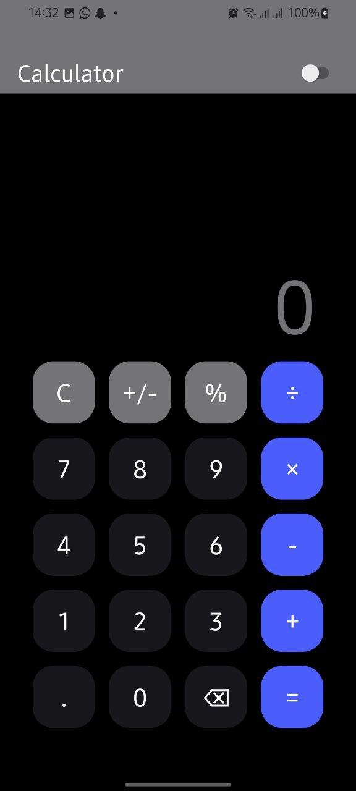
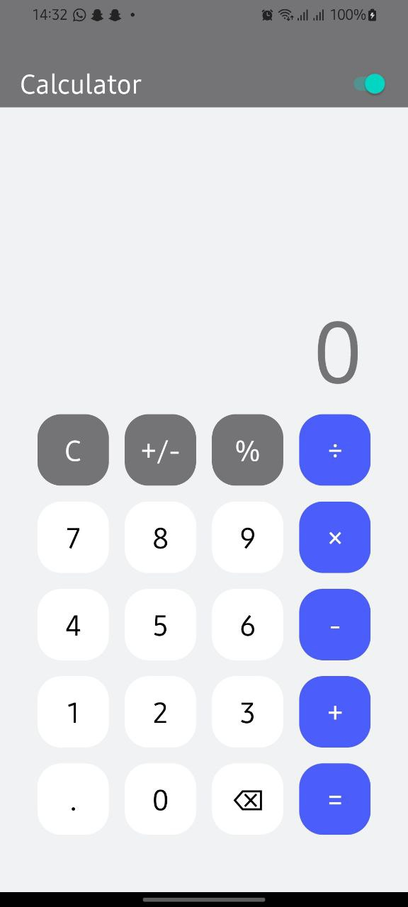
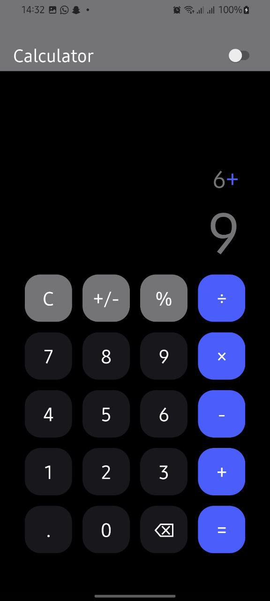
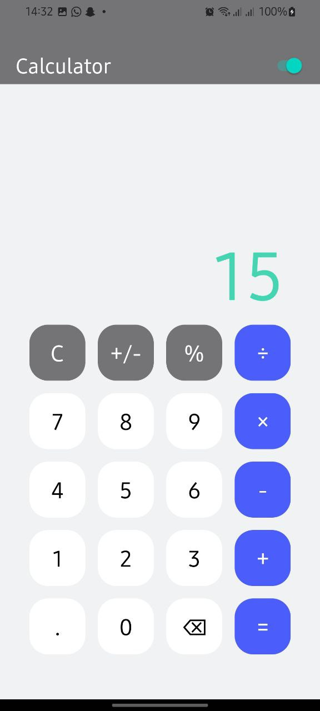

# Calculator

This is a calculator built in react native with a dark theme feature. I used this project to learn some TypeScript syntax, test my knowledge in React Native

## Installation

-   Clone the repository
-   Install expo using `npm install -g expo-cli`
-   Run on an emulator or Expo Go on your real device using `npm start`

## What I Learned

-   Familiarity with `StyleSheet`
-   `useState` `useContext` `creatContext`

# How It Looks

<a href="/">
    
</a >

